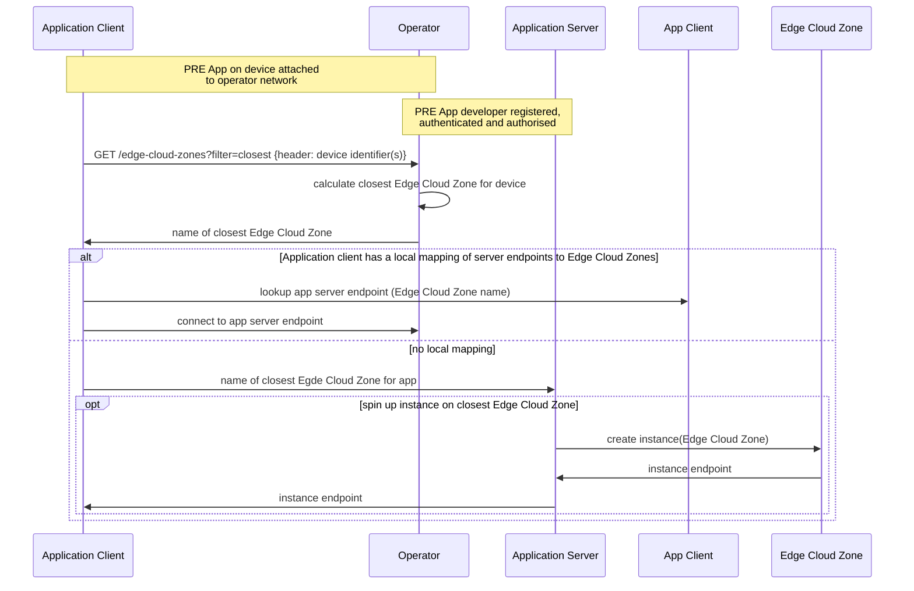
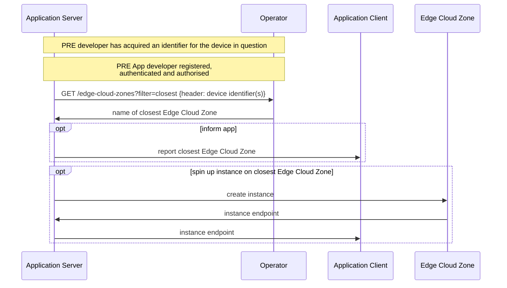

# Simple Edge Discovery API User Story

| **Item** | **Details** |
| ---- | ------- |
| ***Summary*** | As an application developer belonging to an enterprise, I want to discover (using either my application server/backend service, or an HTTP application client on the end-user device) the closest Edge Cloud Zone to a given end-user's device. |
| ***Roles, Actors and Scope*** | **Roles:** Customer:User  **Actors:** Application service providers, network operators, application developers. The API allows a check to see if end-user consent is required: if consent is required, the end-user will be an actor in the consent flow.  
 **Scope:** | Get the name of the Edge Cloud Zone closest to a given end-user's device |
| ***Pre-conditions*** |The preconditions are listed below: <ol><li>The Customer:BusinessManager and Customer:Administrator have been onboarded to the CSP's API platform.</li><li>The Customer:BusinessManager has successfully subscribed to the Simple Edge Discovery product from the product catalog.</li><li>The Customer:Administrator has onboarded the Customer:User to the platform.</li><li>The Customer:User has obtained a valid identifier for the target device, or, will make the API request from an application client on a device connected to the operator's network.</li>|
| ***Activities/Steps*** | **Starts when:** The customer application server/client makes a GET request to the Simple Edge Discovery  API to query the closest Edge Cloud Zone to the target device (an end-user device). The target device is either implicitly identified (e.g. by its source IP when the request is made by an application client on a device attached to the operator network), identified in a 3-legged consent flow including a device object, or explicitly identified in the encrypted GET request header. **Ends when:** The Simple Edge Discovery API responds to the customer application server|client . |
| ***Post-conditions*** | Optional - the customer may decide to act upon the information by connecting the end-user application client to the application server instance hosted at the closest Edge Cloud Zone, and/or spin up an application server instance at that closest Edge Cloud Zone if not currently hosted there.  |
| ***Exceptions*** | the network is unable to calculate the closest Edge Cloud Zone to the end-user device. An HTTP 500 response code will indicate an issue with the provided end-user device identity and that the request should not be retried without correction. HTTP 500 indicates an internal network error and the request may be retried.   |

## API Workflows
### Simple Edge Discovery
#### Scenario 1: direct request from application client on end-user device

Constraints:
- Network: cellular (4G/5G) or fixed/Wi-Fi network with an Edge Cloud Zone deployment.
- Application: browser or app calls API over HTTPS
- Northbound Interface only (no 'UNI' client SDK required) 

Note:
- the Edge Cloud Zone platform may be hosted by the operator or a 3rd party hyperscaler (in which case the developer will need an account with that hyperscaler to create instances)

#### Scenario 2: request from developer server

Constraints:
- Network: cellular (4G/5G) or fixed/Wi-Fi network with an Edge Cloud Zone deployment.
- Application: none, browser or app calls API over HTTP (no client SDK required)
- Dependency: the call must include an identifier for the device (device) for which 'closest MEC' is being calculated

Note: the Edge CLoud Zone platform may be hosted by the operator or a 3rd party hyperscaler (in which case the developer will need an account with that hyperscaler to create instances)

