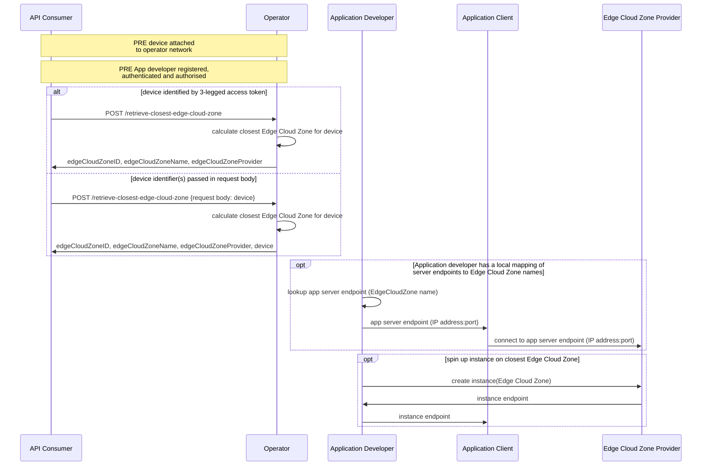

# Simple Edge Discovery API User Story

| **Item** | **Details** |
| ---- | ------- |
| ***Summary*** | As an application developer belonging to an enterprise, I want to discover (using either my application server/backend service, or an HTTPS application client on the end-user device) the closest Edge Cloud Zone to a given end-user's device. |
| ***Roles, Actors and Scope*** | **Roles:** Customer:User  **Actors:** Application service providers, network operators, application developers. The API allows a check to see if end-user consent is required: if consent is required, the end-user will be an actor in the consent flow.  
 **Scope:** | Get the name of the Edge Cloud Zone closest to a given end-user's device |
| ***Pre-conditions*** |The preconditions are listed below: <ol><li>The Customer:BusinessManager and Customer:Administrator have been onboarded to the CSP's API platform.</li><li>The Customer:BusinessManager has successfully subscribed to the Simple Edge Discovery product from the product catalog.</li><li>The Customer:Administrator has onboarded the Customer:User to the platform.</li>|
| ***Activities/Steps*** | **Starts when:** The customer application server/client makes a an HTTPS POST request to the Simple Edge Discovery API to query the closest Edge Cloud Zone to the target device (an end-user device). The target device is either identified in the 3-legged access token where supported, or explicitly identified in the encrypted POST request body. **Ends when:** The Simple Edge Discovery API retruns the request information, or an error message. |
| ***Post-conditions*** | Optional - the customer may decide to act upon the information by connecting the end-user application client to the application server instance hosted at the closest Edge Cloud Zone, and/or spin up an application server instance at that closest Edge Cloud Zone if not currently hosted there.  |
| ***Exceptions*** | 	Several exceptions might occur after a request to the Simple Edge Discovery  API   - Unauthorized: Invalid credentials (e.g. use of already expired access token).   - Invalid Input: Invalid input data to retrieve device details (e.g. MSISDN format not as expected, or MSISDN not associated with a customer of the CSP).  - Forbidden: End user has not consented to device identifier information being provided to the Customer:User   - Service not applicable: the device is not currently attached to an Edge-capable network.   - The network cannot resolve the request due to an internal issue.   - a rate limit/request quota has been exceeded. | 

## API Workflows
### Simple Edge Discovery
#### Scenario 1: request from application developer server or application client on device

Constraints:
- Network: cellular (4G/5G) or fixed/Wi-Fi network with an Edge Cloud Zone deployment.
- Application: browser or app calls API over HTTPS
- Northbound Interface only (no 'UNI' client SDK required) 

Note:
- the Edge Cloud Zone platform may be hosted by the operator or a 3rd party hyperscaler (in which case the developer will need an account with that hyperscaler to create instances)

